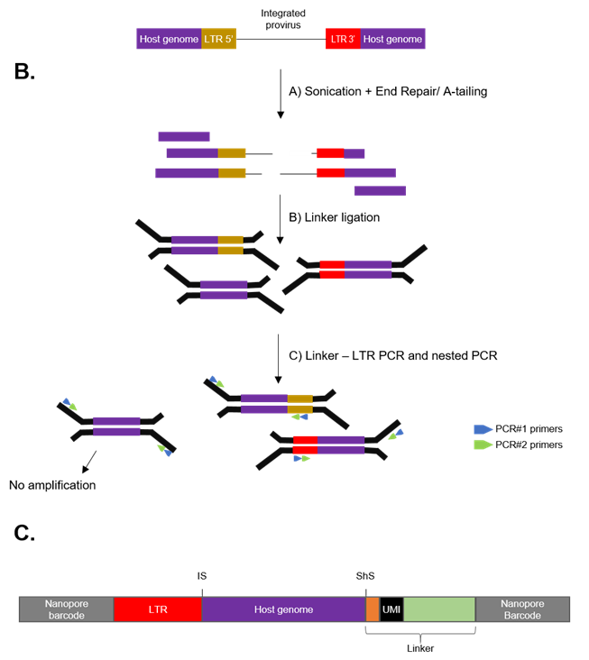

# Integration Sites pipeline
Pipeline optimized to identify integration sites (IS) by long read sequencing using Nanopore technology. 
To do this, the extracted DNA is first fragmented by sonication and the junction between HOST-TARGET sequences (here virus sequences) are amplified by two successive PCRs using specific primers. 
The resulting reads are filtered to keep only the one including viral and host sequences. The main steps and expected structure of the reads are shown bellow for LTR3. 
Same principle is applied for LTR5.



___
## Workflow


## Dependancies
- dorado
- bowtie2 (2-2.1.0)
- Nanofilt (2.8.0)
- samtools (1.16.1)
- bedtools (v2.30.0)
- python (3.10.14)
    - edlib
    - pysam
    - tqdm
    - pandas
    - biopython
- minimap2 (2.26-r1175) + paftools.js
- seqkt (1.5-r133)
- R (> 4.3.1)
    - GenomicRanges
    - Rsamtools
    - changepoint
    - tidyverse
    - GenomicAlignments
    - stringdist

## 1- Basecalling
Basecalling was performed on the files generated from the different sequencing runs using the Dorado basecaller using super accurate basecalling with GPU acceleration, converting .fast5 to .bam formats.
```sh
dorado basecaller --no-trim dna_r10.4.1_e8.2_400bps_sup@v5.0.0 $DATA_DIR > $OUT_BAM_DIR/RUN_${i}_SUP.bam
dorado summary $OUT_BAM_DIR/RUN_${i}_SUP.bam > $OUT_BAM_DIR/RUN_${i}_SUP_summary.tsv
```

## 2- Demultiplexing
Demultiplexing was conducted also using Dorado to separate reads by barcode and remove the Nanopore barcodes at both reads sides.
```sh
dorado demux --kit-name SQK-NBD114-96 $OUT_BAM_DIR/RUN_${i}_SUP.bam --output-dir $OUTPUT_DIR/demux_both_end --barcode-both-ends --emit-fastq
```

## 3- Filtering steps
Reads are filtered according to different criteria including :
- Mapping quality (> Q20)
- Mapping on the LTR5 start or LTR3 end
- Not mapping on provirus without LTR sequences
- Host genome size mapped (> 50bp)

All these steps can be performed using the ```filter_reads.sh``` script that will deal with LTR5 and LTR3 reads separatly.

**Usage**
```sh
./filter_reads.sh -r <string> -o <string> -f <string> -n <string> -i <string> -q <int> -g <int> -a <int> -l <int> -m <int>

Options:
  -r <REF_DIR>         | Path to LTR reference sequences directory
  -o <OUT_DIR>         | Path to output directory
  -f <FASTQ_FILE>      | Path to demultiplexed FASTQ files directory 
  -n <REF_NAME>        | Virus reference name (used for fasta ref files and index names)
  -i <SAMPLE_NAME>     | Sample name (used in prefix for output files)
  -q <MIN_QUALITY>     | Minimum quality for Nanofilt
  -g <LENGTH_GENOME>   | Minimum genome length in reads
  -a <LENGTH_ADAPTOR>  | Adaptor length
  -l <LENGTH_LTR5>     | LTR5 length in reads (with primer)
  -m <LENGHT_LTR3>     | LTR3 length in reads (with primer)
```

Input files :
- Fastq files from demultiplexing
- Fasta sequences of the reference virus without primers (LTR5:"endU3RU5"; LTR3:"stratU3"; INT:"provirus_wo_LTR")
    - ```${VIRUS_NAME}_startU3.fa``` + ```${VIRUS_NAME}_startU3_withprimers.fa``` (LTR5)
    - ```${VIRUS_NAME}_endU3RU5.fa``` + ```${VIRUS_NAME}_endU3RU5_withprimers.fa``` (LTR3)
    - ```${VIRUS_NAME}_provirus_wo_LTR.fa``` (INT)
  
Outputs for each LTR${a} with a in {3,5}:
- ```${SAMPLE_NAME}_mapping_LTR${a}_SUP.sam``` : Mapping results on start LTR5 or end LTR3
- ```${SAMPLE_NAME}_LTR${a}_filtered_size_SUP.fastq``` : Reads mapped on LTR but not provirus + size filtering

## 4- Extract UMI 
In order to remove PCR duplicates for clonality quantification in the Step 6- it is necessary to extract UMI sequences from all the reads.
We thus modified a python script from the INSERT-seq pipeline ([Ivančić et al., 2022](https://genomebiology.biomedcentral.com/articles/10.1186/s13059-022-02778-9)) to adapt it to our needs (```insert_seq_extract_umi_modif.py```). 
Briefly this script is based on the specific structure of the UMIs integrated in the fixed linker sequences. These UMI are 16bp long and composed as bellow :
- ```"TTTVVVVTTVVVVTTVVVVTTVVVVTTT"``` : where "T" nucleotides are fixed and V are either "A", "G" or "C" for forward orientation
- ```"AAABBBBAABBBBAABBBBAABBBBAAA"``` : where "A" nucleotides are fixed and B are either "T", "G" or "C" for reverse orientation

The workflow to extract the UMI from the reads is composed of different steps :
- Define UMI structure based on the LTR (different inputs for LTR5 or 3) 
- As the UMI are located in the linker at the extremity of the reads, extract the begining or the end of the reads using the length of the adapter depending on the strand (+/-) and LTR (5 or 3).
- Align the sequence of the linker to the UMI pattern (using semi-global alignment)
- Identify UMI in the linker sequences allowing --max-error mismatchs/indels
- Write in a fasta output the reads and headers including read_ID, strand, UMI sequence distance from UMI pattern and UMI sequence

The UMI extraction can be performed using the ```extract_umi.sh``` script.

**Usage**
```sh
./extract_umi.sh -s <string> -o <string> -a <int> -e <int> -i <string>

Options:
  -s <DATA_SAM>         | Path to directory of the SAM files obtained after the LTR mapping
  -o <DIR_UMI>          | Path to UMI output directory
  -a <ADAPTER_LENGTH>   | Linker size 
  -e <MAX_ERROR>        | Max pattern distance for UMI sequences (allowed mismatchs/indels)
  -i <SAMPLE_PREFIX>    | Sample name used as prefix for output files
```
Input files for each LTR${a} with a in {3,5}:
- ```${SAMPLE_NAME}_mapping_LTR${a}_SUP.sam``` : sam files obtained after bowtie2 mapping on LTR5 and LTR3
  
Output files for each LTR${a} with a in {3,5}:
- ```${SAMPLE_NAME}_LTR${a}_UMI.fasta``` : read sequences with identified UMI sequences in the read names
  
## 5- Mapping
The filtered reads are then mapped on the reference genome concatenated with the virus start LTR5 and end LTR3 sequences in order to detect the HOST-TARGET junctions.
The steps includes :
- Masking the reference genome with the apparented ERV sequences
- Create the hybrid reference concatenating host genome and LTR sequences
- Map the filtered reads on the hybrid genome using minimap2

The first optional step is to prepare the host reference genome (masking + delete scaffold if wanted):
```sh
####Mask the reference genome using ERV/TE annotation
bedtools maskfasta -fi reference_genome.fa -bed TE_annotation.bed -fo ref_masked.fa
####Using the prefix of the chromosomes, delete the scaffolds from the reference
prefix_chr="NC"
awk -v prefix_chr="^>${prefix_chr}" ' BEGIN { keep=0 } /^>/ { keep = ($0 ~ prefix_chr) } keep { print } ' ref_masked.fa > ref_noscaffold_masked.fa
```

The mapping can then be performed using the ```mapping.sh``` script.

**Usage**
```sh
./mapping.sh -r <string> -f <string> -o <string> -q <string> -n <string> -i <string>

Options:
  -r <REF_DIR>         | Path to directory of the reference files
  -f <REF_NAME>        | Name of the reference genome file in .fasta
  -o <OUT_DIR>         | Path to directory for output files
  -q <FASTQ_DIR>       | Path to directory containining the input .fastq files
  -n <VIRUS_NAME>      | Name of the virus sequence used in reference for the target
  -i <SAMPLE_PREFIX>   | Sample prefix for output files
```

Input files for each LTR${a} with a in {3,5}:
- ```ref_noscaffold_masked.fa``` : Reference genome in fasta
- ```${VIRUS_NAME}_endU3RU5_withprimer.fa``` + ```${VIRUS_NAME}_startU3_withprimer.fa``` : Virus LTR reference sequences in fasta (with primers)
- ```${SAMPLE_NAME}_LTR${a}_filtered_size_SUP.fastq``` : Fastq files after bowtie2 mapping + filtering

Output files for each LTR${a} with a in {3,5}:
- ```${SAMPLE_NAME}_LTR${a}_mapped_ref_noscaffold_masked.fa_SUP.paf``` : minimap2 output file in paf
 

## 6- Integration sites extraction
After the mapping, the goal is to identify the different integration sites using reads at the junction between LTR sequences and host genome. This step <as adapted from PCIP-seq ([Artesi et al., 2021](https://genomebiology.biomedcentral.com/articles/10.1186/s13059-021-02307-0)).  
The main steps are:
- Keep reads mapped on the host genome and on the LTR sequences
- Get the Integration Sites (IS) corresponding to the HOST-LTR junction and ShearSites (ShS) corresponding to HOST-LINKER junction
- Create ShS groups clustering reads with ShS < maxgapShS + UMI group using ```UMI_clustering_hamming_ref.py``` if reads have same UMI (+/- x mismatches)
- Remove PCR duplicates according to the IS, ShS and UMI groups
- Merge LTR5 and LTR3 information and keep max sister cells count
- Quantify clonal abundancy (for each IS nb of sister cells without PCR duplicates)

All these steps can be performed using ```run_IS.sh``` script that will call different R functions.

**Usage**
```sh
./run_IS.sh -i SAMPLE_NAME -r R_PACKAGE_PATH -o OUT_PATH -p INPUT_PAF_PATH -u INPUT_UMI_PATH -a ASSEMBLY \
          -5 TNAME_LTR5 -L LENGTH_LTR5 -3 TNAME_LTR3 -l LENGTH_LTR3 \
          -g MAXGAP_IS -q MAPQ -n NB_READ_PER_UMI -s MAXGAP_SHS -m MMS -t THRESHOLD_RAW -w WIN_MERGE

Options:
  -i <SAMPLE_NAME>         | Name of the sample (ex: barcode01)
  -r <R_PACKAGE_PATH>      | Path to directory of the different R functions (ex: "~/script/Rpackages/")
  -o <OUT_PATH>            | Path to directory for output files (ex: "~/results/R_clonality/")
  -p <INPUT_PAF_PATH>      | Path to directory of the paf input files obtained after the step 5 (ex: "~/results/mapping/paf/")
  -u <INPUT_UMI_PATH>      | Path to directory of the UMI input files obtained after the step 4 (ex: "~/results/extract_UMI/")
  -a <ASSEMBLY>            | Name of the reference genome assembly

  -5 <TNAME_LTR5>          | Name of the LTR5 virus sequence (used for the minimap2 mapping)
  -L <LENGTH_LTR5>         | Total length of the LTR5 sequence (with primers)
  -3 <TNAME_LTR3>          | Name of the LTR3 virus sequence (used for the minimap2 mapping)
  -l <LENGTH_LTR3>         | Total length of the LTR3 sequence (with primers)

  -g <MAXGAP_IS>           | Maximal distance between IS to merge
  -q <MAPQ>                | Minimum quality of mapping
  -n <NB_READ_PER_UMI>     | Minimum number of reads to conserve a UMI group
  -s <MAXGAP_SHS>          | Maximal distance between ShS to merge
  -m <MMS>                 | Maximum number of mismatchs to regroup UMI in a group
  -t <THRESHOLD_RAW>       | Minimum number of raw reads by IS to keep it
  -w <WIN_MERGE>           | Maximal distance between LTR5 and LTR3 IS to merge
```

Input files for each LTR${a} with a in {3,5}:
- ```${SAMPLE_NAME}_LTR${a}_mapped_ref_noscaffold_masked.fa_SUP.paf``` : Mapped and filtered reads from minimap2
- ```${SAMPLE_NAME}_LTR${a}_UMI.fasta``` : Read sequences with identified UMI sequences in the read names obtained form extract_UMI step

Output files :
- ```${SAMPLE_NAME}_clonalityResults_mms${MMS}_ShS${MAXGAP_SHS}.txt``` : Final IS results with clonality %
  
The clonality output file is composed of several columns :
```sh
C1: Chromosome
C2: Strand
C3: IS position estimate 
C4: Minimum IS position gave by LTR5 reads (grouped by IS position +/- maxgapIS)
C5: Maximum IS position gave by LTR5 reads (grouped by IS position +/- maxgapIS)
C6: Minimum IS position gave by LTR3 reads (grouped by IS position +/- maxgapIS)
C7: Maximum IS poisiton gave by LTR3 reads (grouped by IS position +/- maxgapIS)
C8: IS supported by LTR5, LTR3 or both LTR5 and LTR3 reads
C9: Raw number of reads associated to the IS
C10: Number of ShearSites groups associated to the IS (ShS grouped by position +/- maxgapShS)
C11: Number of sister cells associated to the IS (= Unique ShearSite groups and UMI groups. UMI groups obtained merging UMI sequences +/- mms)
C12: Proportion of sister cells associated to the IS compared to the total number of sister cells for all IS (in %)
```

## Pipeline test
To test the pipeline, test datasets are available in the ```test_file``` folder as well as a README file to have a step-by-step procedure to install and test the pipeline. 


___
## Correspondance
- Benjamin Riocreux-Verney
- Marie Verneret
- Jocelyn Turpin (jocelyn.turpin@univ-lyon1.fr)

## Citation
___
